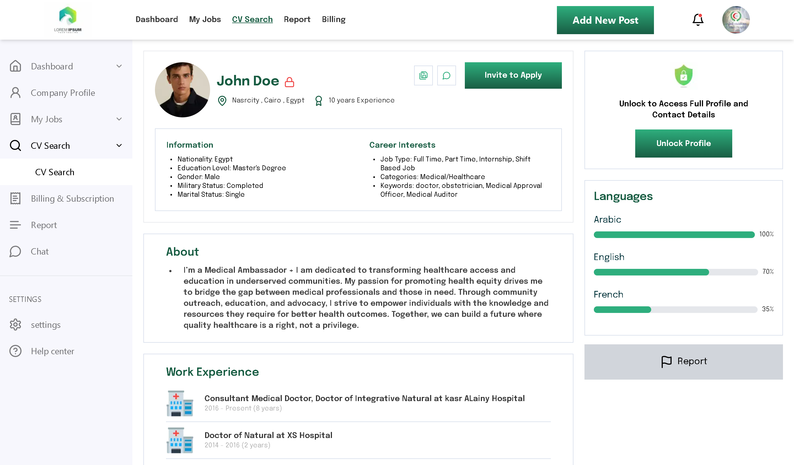

# [Profile Lock Dashboard](https://profile-locked.vercel.app/)

## Project Description

The **Profile Lock Dashboard** is a fully responsive web page built using **Next.js** and **Tailwind CSS**. It is designed as a user dashboard, featuring a sidebar with sections for profile information, job management, and various other features like billing, report generation, and CV search. The dashboard includes a profile lock feature where users can unlock and access more detailed profile information.

This page is responsive, meaning it adjusts to different screen sizes and is designed to offer a smooth and accessible user experience.

## Features

- **Sidebar Navigation**: Includes links to "Dashboard", "My Jobs", "CV Search", "Billing", "Report", and more.
- **Profile Information**: Displays essential information about the user, including name, profile picture, location, years of experience, and career interests.
- **Profile Security**: A "Profile Lock" feature that lets users unlock their profile to access contact details.
- **Languages**: Displays proficiency in multiple languages (Arabic, English, French).
- **Experience & Education**: Lists the user’s work experience, education history, and skills.
- **Mobile-First Design**: Fully responsive and optimized for mobile and desktop views.

## Demo

- Live Demo: [demo.com](https://profile-locked.vercel.app/)

## Installation Instructions

1. Clone the repository:

   ```bash
   git clone https://github.com/AbdElRahman501/profile-locked.git
   ```

2. Navigate into the project directory:

   ```bash
   cd profile-lock-dashboard
   ```

3. Install dependencies:

   ```bash
   npm install
   ```

4. Run the development server:

   ```bash
   npm run dev
   ```

5. Open your browser and go to `http://localhost:3000` to view the app.

## Technologies Used

- **Next.js** (Version 14.2.5) for building the app.
- **TypeScript** for strong typing and better development experience.
- **Tailwind CSS** (Version 3.4.15) for responsive and utility-first styling.

## Screenshots



## Contact

For any questions or further assistance, feel free to reach out at [Abdelrahman.6182@gmail.com].
